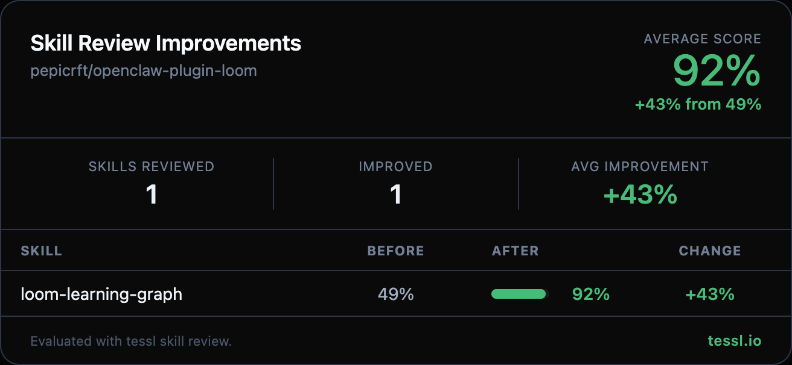

Hey @pepicrft 👋

I ran your skills through `tessl skill review` at work and found some targeted improvements. Here's the full before/after:

| Skill | Before | After | Change |
|-------|--------|-------|--------|
| loom-learning-graph | 49% | 92% | +43% |

> **Note:** The original SKILL.md had no YAML frontmatter, which caused it to score 10%. I added minimal frontmatter (name + description) to get a meaningful baseline of 49%, then optimized from there.

Changes made

- **Added structured frontmatter** with kebab-case name, detailed description, and explicit "Use when..." trigger clause covering six distinct scenarios (learn a topic, track knowledge, build concept map, spaced repetition review, capture real-world moments, query library)
- **Added trigger-to-action mapping table** so the agent knows exactly which tool to call for each user intent
- **Added concrete JSON examples** for `learn_add_node` and `learn_capture` tool invocations with realistic parameters
- **Documented tool behavior details** — rating effects on familiarity, mastery threshold, `learn_next` prioritization logic, `learn_query` modes
- **Structured the workflow** as a clear 5-step sequence with specific tool calls at each step
- **Consolidated node authoring guidelines** into a focused section, removing redundancy between the old "What a Node Contains", "When to Create Nodes", and "How to Expand the Graph" sections
- **Removed purpose section** that restated the description

Honest disclosure — I work at @tesslio where we build tooling around skills like these. Not a pitch - just saw room for improvement and wanted to contribute.

Want to self-improve your skills? Just point your agent (Claude Code, Codex, etc.) at [this Tessl guide](https://docs.tessl.io/evaluate/optimize-a-skill-using-best-practices) and ask it to optimize your skill. Ping me - [@yogesh-tessl](https://github.com/yogesh-tessl) - if you hit any snags.

Thanks in advance 🙏
